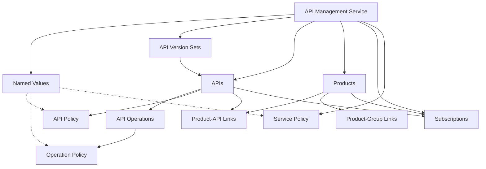

# Phase 1: Foundation & Planning - Research and Design

**Date:** 2025-10-17  
**Status:** In Progress  
**Goal:** Set up structure and understand requirements for Core API Management features

---

## 1. Bicep Module Analysis

### Source
- **Bicep AVM Module**: `Azure/bicep-registry-modules/avm/res/api-management/service`
- **API Version**: 2024-05-01

### Key Findings from Bicep Module

#### 1.1 Named Values (`namedValues`)
**Bicep Structure:**
```bicep
namedValues: [
  {
    name: string           // Required
    displayName: string    // Required
    value: securestring    // Optional (conflicts with keyVault)
    secret: bool           // Optional (default: false)
    tags: array           // Optional
    keyVault: {           // Optional
      secretIdentifier: string
      identityClientId: string
    }
  }
]
```

**Key Features:**
- Supports plain text values
- Supports Key Vault secret references
- Can mark values as secret (encrypted)
- Tagging support for filtering
- Identity-based Key Vault access

---

#### 1.2 API Version Sets (`apiVersionSets`)
**Bicep Structure:**
```bicep
apiVersionSets: [
  {
    name: string                    // Required
    displayName: string            // Required
    versioningScheme: string       // Required: 'Header' | 'Query' | 'Segment'
    description: string            // Optional
    versionHeaderName: string      // Conditional: Required if scheme = Header
    versionQueryName: string       // Conditional: Required if scheme = Query
  }
]
```

**Key Features:**
- Three versioning schemes
- Conditional validation based on scheme
- APIs reference version sets by name

---

#### 1.3 APIs (`apis`)
**Bicep Structure:**
```bicep
apis: [
  {
    name: string                     // Required
    displayName: string             // Required
    path: string                    // Required (URL path)
    serviceUrl: string              // Optional (backend service URL)
    apiType: string                 // Optional: 'http' | 'soap' | 'websocket' | 'graphql'
    type: string                    // Optional: 'http' | 'soap' | 'websocket' | 'graphql'
    protocols: array                // Optional: ['http', 'https']
    
    // Import Support
    format: string                  // Optional: 'openapi' | 'openapi-link' | 'openapi+json' | 'wsdl' | etc.
    value: string                   // Optional: API definition content or URL
    
    // Versioning
    apiVersion: string              // Optional
    apiVersionSetName: string       // Optional (references version set)
    apiRevision: string             // Optional
    apiRevisionDescription: string  // Optional
    isCurrent: bool                 // Optional
    
    // Security & Access
    subscriptionRequired: bool      // Optional
    subscriptionKeyParameterNames: object  // Optional
    authenticationSettings: object  // Optional
    
    // Child Resources
    operations: [                   // Optional
      {
        name: string
        displayName: string
        method: string              // GET, POST, PUT, DELETE, etc.
        urlTemplate: string
        description: string
        templateParameters: array
        request: object
        responses: array
        policies: [                 // Operation-level policies
          {
            name: string
            format: string
            value: string
          }
        ]
      }
    ]
    
    policies: [                     // API-level policies
      {
        name: string
        format: string              // 'xml' | 'rawxml' | 'xml-link' | 'rawxml-link'
        value: string
      }
    ]
    
    diagnostics: array              // Optional
  }
]
```

**Key Features:**
- Multiple import formats (OpenAPI, WSDL, WADL, GraphQL)
- Versioning and revision support
- Nested operations with policies
- API-level and operation-level policies
- Subscription requirements
- Protocol support

---

#### 1.4 Products (`products`)
**Bicep Structure:**
```bicep
products: [
  {
    name: string                    // Required
    displayName: string            // Required
    description: string            // Optional
    terms: string                  // Optional (terms of use)
    subscriptionRequired: bool     // Optional
    approvalRequired: bool         // Optional
    subscriptionsLimit: int        // Optional
    state: string                  // Optional: 'notPublished' | 'published'
    
    // Associations
    apis: array                    // Optional (array of API names)
    groups: array                  // Optional (array of group names)
  }
]
```

**Key Features:**
- Product visibility and state management
- Subscription and approval workflows
- Links to APIs and Groups
- Terms of use support

---

#### 1.5 Subscriptions (`subscriptions`)
**Bicep Structure:**
```bicep
subscriptions: [
  {
    name: string                   // Required
    displayName: string           // Required
    scope: string                 // Optional: '/products/{id}' | '/apis/{id}' | '/apis'
    ownerId: string               // Optional: '/users/{id}'
    primaryKey: string            // Optional
    secondaryKey: string          // Optional
    state: string                 // Optional: 'active' | 'suspended' | 'submitted' | etc.
    allowTracing: bool            // Optional
  }
]
```

**Key Features:**
- Flexible scoping (product, API, all APIs)
- Custom key support
- User ownership
- State management
- Tracing support

---

#### 1.6 Service-Level Policies (`policies`)
**Bicep Structure:**
```bicep
policies: [
  {
    name: string                   // Optional (usually 'policy')
    format: string                 // Optional: 'xml' | 'rawxml' | 'xml-link' | 'rawxml-link'
    value: string                  // Required (XML policy content)
  }
]
```

**Note:** In Bicep this is an array, but in Azure there's only ONE service-level policy.

---

## 2. Azure Provider Resources

### 2.1 Resource Inventory

| Resource | Purpose | Complexity |
|----------|---------|------------|
| `azurerm_api_management_named_value` | Configuration & secrets | Medium |
| `azurerm_api_management_api_version_set` | API versioning | Low |
| `azurerm_api_management_api` | API definitions | High |
| `azurerm_api_management_api_operation` | HTTP operations | Medium |
| `azurerm_api_management_api_policy` | API-level policies | Medium |
| `azurerm_api_management_api_operation_policy` | Operation-level policies | Medium |
| `azurerm_api_management_product` | API grouping | Medium |
| `azurerm_api_management_product_api` | Product-API links | Low |
| `azurerm_api_management_product_group` | Product-Group links | Low |
| `azurerm_api_management_subscription` | Access keys | Medium |
| `azurerm_api_management_policy` | Service-level policy | Low |

### 2.2 Provider Version Requirements
- **azurerm**: >= 4.0, < 5.0 (already configured in `terraform.tf`)

---

## 3. Resource Dependencies

### 3.1 Dependency Graph



### 3.2 Creation Order
1. **API Management Service** (exists - `azurerm_api_management.this`)
2. **Named Values** (can be referenced in policies)
3. **API Version Sets** (required before APIs if using versioning)
4. **APIs** (core resource)
5. **API Operations** (child of APIs)
6. **API Policies** (depends on APIs)
7. **API Operation Policies** (depends on Operations)
8. **Products** (can exist independently)
9. **Product-API Links** (depends on Products and APIs)
10. **Product-Group Links** (depends on Products)
11. **Subscriptions** (depends on Products or APIs)
12. **Service-Level Policy** (can reference named values)

---

## 4. Variable Design

### 4.1 Named Values Variable

```hcl
variable "named_values" {
  type = map(object({
    display_name = string
    value        = optional(string)        # Conflicts with key_vault
    secret       = optional(bool, false)
    tags         = optional(list(string), [])
    
    key_vault = optional(object({
      secret_id        = string
      identity_client_id = optional(string)
    }))
  }))
  default     = {}
  description = <<DESCRIPTION
Named values for the API Management service. The map key is the named value name.

- `display_name` - (Required) The display name of the named value.
- `value` - (Optional) The value of the named value. Conflicts with `key_vault`.
- `secret` - (Optional) Whether the value is a secret. Default is `false`.
- `tags` - (Optional) Tags for filtering named values.
- `key_vault` - (Optional) Key Vault configuration for secret values.
  - `secret_id` - (Required) The Key Vault secret identifier.
  - `identity_client_id` - (Optional) The client ID of the managed identity for Key Vault access.
DESCRIPTION
  nullable    = false
  
  validation {
    condition = alltrue([
      for k, v in var.named_values :
      (v.value != null && v.key_vault == null) || (v.value == null && v.key_vault != null)
    ])
    error_message = "Each named value must have either 'value' or 'key_vault' specified, but not both."
  }
}
```

### 4.2 API Version Sets Variable

```hcl
variable "api_version_sets" {
  type = map(object({
    display_name         = string
    versioning_scheme    = string  # Header, Query, Segment
    description          = optional(string)
    version_header_name  = optional(string)  # Required if scheme = Header
    version_query_name   = optional(string)  # Required if scheme = Query
  }))
  default     = {}
  description = <<DESCRIPTION
API Version Sets for the API Management service. The map key is the version set name.

- `display_name` - (Required) The display name of the API version set.
- `versioning_scheme` - (Required) The versioning scheme. Valid values: `Header`, `Query`, `Segment`.
- `description` - (Optional) Description of the API version set.
- `version_header_name` - (Optional) Name of the HTTP header parameter for `Header` scheme.
- `version_query_name` - (Optional) Name of the query parameter for `Query` scheme.
DESCRIPTION
  nullable    = false
  
  validation {
    condition = alltrue([
      for k, v in var.api_version_sets :
      contains(["Header", "Query", "Segment"], v.versioning_scheme)
    ])
    error_message = "versioning_scheme must be one of: Header, Query, Segment."
  }
  
  validation {
    condition = alltrue([
      for k, v in var.api_version_sets :
      v.versioning_scheme != "Header" || v.version_header_name != null
    ])
    error_message = "version_header_name is required when versioning_scheme is 'Header'."
  }
  
  validation {
    condition = alltrue([
      for k, v in var.api_version_sets :
      v.versioning_scheme != "Query" || v.version_query_name != null
    ])
    error_message = "version_query_name is required when versioning_scheme is 'Query'."
  }
}
```

### 4.3 APIs Variable (Simplified - Full version will be complex)

```hcl
variable "apis" {
  type = map(object({
    display_name    = string
    path            = string
    service_url     = optional(string)
    protocols       = optional(list(string), ["https"])
    
    # Import configuration
    import = optional(object({
      format      = string  # openapi, openapi-link, wsdl, etc.
      content_value = string  # API definition or URL
    }))
    
    # Versioning
    api_version          = optional(string)
    api_version_set_name = optional(string)  # References version set
    revision             = optional(string)
    revision_description = optional(string)
    
    # Access control
    subscription_required = optional(bool, true)
    
    # Operations
    operations = optional(map(object({
      display_name       = string
      method            = string  # GET, POST, PUT, DELETE, PATCH, HEAD, OPTIONS, TRACE
      url_template      = string
      description       = optional(string)
      template_parameters = optional(list(object({
        name        = string
        type        = string
        required    = optional(bool, false)
        description = optional(string)
      })), [])
    })), {})
    
    # Policies
    policy = optional(object({
      xml_content = string
      xml_link    = optional(string)
    }))
  }))
  default     = {}
  description = "APIs for the API Management service."
  nullable    = false
}
```

### 4.4 Products Variable

```hcl
variable "products" {
  type = map(object({
    display_name          = string
    description           = optional(string)
    terms                 = optional(string)
    subscription_required = optional(bool, false)
    approval_required     = optional(bool, false)
    subscriptions_limit   = optional(number)
    state                 = optional(string, "published")  # published, notPublished
    
    # Associations
    api_names   = optional(list(string), [])
    group_names = optional(list(string), [])
  }))
  default     = {}
  description = "Products for the API Management service."
  nullable    = false
  
  validation {
    condition = alltrue([
      for k, v in var.products :
      contains(["published", "notPublished"], v.state)
    ])
    error_message = "Product state must be either 'published' or 'notPublished'."
  }
}
```

### 4.5 Subscriptions Variable

```hcl
variable "subscriptions" {
  type = map(object({
    display_name   = string
    scope          = string  # /products/{name} or /apis/{name} or /apis
    user_id        = optional(string)  # /users/{id}
    primary_key    = optional(string)
    secondary_key  = optional(string)
    state          = optional(string, "active")  # active, suspended, submitted, etc.
    allow_tracing  = optional(bool, false)
  }))
  default     = {}
  description = "Subscriptions for the API Management service."
  nullable    = false
  sensitive   = true
  
  validation {
    condition = alltrue([
      for k, v in var.subscriptions :
      can(regex("^/(products|apis)", v.scope))
    ])
    error_message = "Subscription scope must start with /products/ or /apis."
  }
}
```

### 4.6 Service Policy Variable

```hcl
variable "service_policy" {
  type = object({
    xml_content = optional(string)
    xml_link    = optional(string)
  })
  default     = null
  description = <<DESCRIPTION
Service-level policy for the API Management service.

- `xml_content` - (Optional) The XML content of the policy.
- `xml_link` - (Optional) A URL to the policy XML.

Note: Specify either `xml_content` or `xml_link`, not both.
DESCRIPTION
  
  validation {
    condition = var.service_policy == null || (
      (var.service_policy.xml_content != null && var.service_policy.xml_link == null) ||
      (var.service_policy.xml_content == null && var.service_policy.xml_link != null)
    )
    error_message = "Specify either xml_content or xml_link, not both."
  }
}
```

---

## 5. File Structure

### Proposed New Files

```
terraform-azurerm-avm-res-apimanagement-service/
├── main.tf                          # Existing - APIM service
├── main.namedvalues.tf              # NEW - Named values
├── main.apiversionsets.tf           # NEW - API version sets
├── main.apis.tf                     # NEW - APIs and operations
├── main.apioperations.tf            # NEW - API operations (if separated)
├── main.apipolicies.tf              # NEW - API and operation policies
├── main.products.tf                 # NEW - Products and associations
├── main.subscriptions.tf            # NEW - Subscriptions
├── main.policies.tf                 # NEW - Service-level policy
├── variables.tf                     # MODIFIED - Add new variables
├── outputs.tf                       # MODIFIED - Add new outputs
└── locals.tf                        # MODIFIED - Add helper locals
```

---

## 6. Key Patterns from Existing Module

### Pattern 1: Map-based Resources with Dynamic Blocks

```hcl
# Example from existing code
resource "azurerm_role_assignment" "this" {
  for_each = var.role_assignments

  principal_id     = each.value.principal_id
  scope            = azurerm_api_management.this.id
  # ...
}
```

**Apply to:** All new resources (named_values, apis, products, etc.)

### Pattern 2: Optional Object Properties

```hcl
# Example from existing code
variable "lock" {
  type = object({
    kind = string
    name = optional(string, null)
  })
  default     = null
  description = "..."
}
```

**Apply to:** All variable designs use `optional()` extensively

### Pattern 3: Validation Rules

```hcl
# Example from existing code
validation {
  condition     = contains(["None", "External", "Internal"], var.virtual_network_type)
  error_message = "The virtual_network_type must be one of: None, External, or Internal."
}
```

**Apply to:** Validate enums, conditional requirements, mutual exclusions

---

## 7. Next Steps

### Immediate Tasks
- [x] Complete Bicep analysis
- [x] Document all resources
- [x] Map dependencies
- [x] Design all variable structures
- [ ] **Review variable designs** (awaiting user feedback)
- [ ] Create example usage snippets
- [ ] Begin Phase 2 implementation

### Questions for Review
1. Should API operations be in a separate file or combined with APIs?
2. Should policies be in a separate file or combined with APIs?
3. Do we need additional validation rules?
4. Are the variable structures clear and AVM-compliant?

---

## Status Summary

✅ **Completed:**
- Bicep module analysis
- Resource inventory and documentation
- Dependency mapping
- Variable structure design (all 6 variables)
- File structure planning

⏳ **Pending Review:**
- Variable designs approval
- File organization decisions
- Additional validation requirements

---

**Next Phase:** Phase 2 - Named Values Implementation (after approval)
